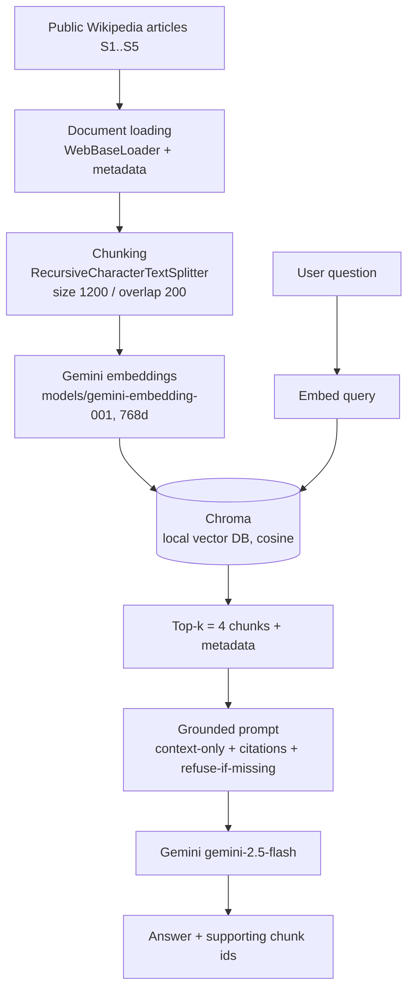

# Building a RAG Application with Gemini

Homework for the LLM / RAG workshop. It extends the three workshop notebooks by
replacing every toy component of the local RAG (notebook `03`) with its
production counterpart: **Gemini** for generation, **Gemini embeddings** for
retrieval, **LangChain** for orchestration and **Chroma** as a local vector
database.

## MADE BY
- Sebastian Albarracin Silva
##
## 1. Objective and use case

**Objective:** build a small Retrieval-Augmented Generation application and be
able to explain how documents become embeddings, how relevant information is
retrieved, and how retrieved evidence is incorporated into an LLM response.

**Use case:** a *study assistant for LLM / Transformer / RAG fundamentals*. It
answers conceptual questions grounded in a small collection of public Wikipedia
articles, and explicitly says what is missing when the articles do not contain
the answer.

## 2. Document collection

All sources are public Wikipedia articles (text licensed **CC BY-SA 4.0**),
loaded live with `WebBaseLoader` (only the article body, `div.mw-parser-output`,
is kept).

| id | Title | URL |
|----|-------|-----|
| S1 | Large language model | https://en.wikipedia.org/wiki/Large_language_model |
| S2 | Transformer (deep learning architecture) | https://en.wikipedia.org/wiki/Transformer_(deep_learning_architecture) |
| S3 | Retrieval-augmented generation | https://en.wikipedia.org/wiki/Retrieval-augmented_generation |
| S4 | Word embedding | https://en.wikipedia.org/wiki/Word_embedding |
| S5 | Vector database | https://en.wikipedia.org/wiki/Vector_database |

**Why these:** they span the whole pipeline taught in the workshop — what an LLM
is (S1), the architecture behind it (S2), how meaning is represented as vectors
(S4), how those vectors are stored and searched (S5), and how retrieval is
combined with generation (S3).

Metadata preserved per chunk: `source_id`, `title`, `url` / `source`,
`retrieved_at`, `license`, `chunk_id` (`"<source_id>:<n>"`, used as the citation
handle).

## 3. Architecture



Text version:

```
sources -> load (WebBaseLoader) -> chunk (RecursiveCharacterTextSplitter)
        -> embed (gemini-embedding-001) -> store (Chroma, persisted)

question -> embed -> similarity search in Chroma -> top-4 chunks
         -> build grounded prompt -> Gemini (gemini-2.5-flash) -> grounded answer + sources
```

Two retrieval architectures are implemented:

- **Two-step RAG chain** — retrieval is hard-wired before a single Gemini call
  (LangChain LCEL).
- **RAG agent** — the same retriever is exposed as a tool; a LangGraph ReAct
  agent decides whether to call it (>= 2 Gemini calls).

## 4. Installation and execution

Requires **Python 3.10+** (3.11+ recommended).

```bash
# 1. clone, then from the repo root:
python -m venv .venv
.venv\Scripts\activate          # Windows
# source .venv/bin/activate     # macOS / Linux
pip install -r requirements.txt

# 2. credentials
copy .env.example .env          # Windows  (cp on macOS/Linux)
# edit .env and set GOOGLE_API_KEY

# 3. run
jupyter notebook notebooks/rag_application.ipynb
```

Run the notebook top to bottom. The first run builds and persists the Chroma DB
in `data/chroma/` (git-ignored); later runs reuse it.

Get a free Gemini API key at <https://aistudio.google.com/apikey>.

## 5. Environment variables

| Variable | Required | Description |
|----------|----------|-------------|
| `GOOGLE_API_KEY` | yes | Gemini Developer API key (free tier). Stored only in local `.env`. |
| `USER_AGENT` | no | Sent to Wikipedia when fetching pages. Defaults to `rag-homework/1.0 (educational use)`. |

`.env` is in `.gitignore`; `.env.example` documents the names with no real values.

## 6. Models used

| Role | Exact identifier |
|------|------------------|
| Chat / generation | `gemini-2.5-flash` |
| Embeddings | `models/gemini-embedding-001` (output dimensionality **768**) |

> If your `langchain-google-genai` version rejects `output_dimensionality`,
> remove that argument (the default 3072-d embedding also works).

## 7. Principal design decisions

| Decision | Choice | Rationale |
|----------|--------|-----------|
| Loader | `WebBaseLoader` restricted to `div.mw-parser-output` | drops nav / sidebar / footer so chunks are article text only |
| Splitter | `RecursiveCharacterTextSplitter` | respects paragraph -> line -> sentence boundaries |
| `chunk_size` | 1200 chars (~200-300 tokens) | holds a full definition/paragraph while staying "one idea per embedding" |
| `chunk_overlap` | 200 chars | keeps an idea retrievable when it straddles a chunk boundary |
| `top_k` | 4 | enough to synthesize and cite 2-3 chunks; keeps the prompt small/cheap on the free tier |
| Distance | cosine (`hnsw:space: cosine`) | standard for text embedding similarity |
| Embedding dim | 768 (Matryoshka) | ~4x smaller DB and faster search with negligible quality loss at this scale |
| Ingestion | batched (50) with a short pause, skipped if collection is populated | respects free-tier embedding rate limits; notebook is safe to re-run |
| Grounding | prompt forbids outside knowledge, requires `[chunk_id]` citations, and requires an explicit "what is missing" when context is thin | makes groundedness checkable |
| Generation temperature | 0 | deterministic, easier to evaluate |

## 8. Evaluation results

Three questions were tested through the two-step chain (retrieved chunks and
final answers inspected side by side in the notebook).

| # | Question | Retrieved source | Result | Grounded? | Observation |
|---|----------|------------------|--------|-----------|-------------|
| 1 | What is the self-attention mechanism in the transformer architecture? | S2 – Transformer | Correct definition | Yes | Direct evidence in S2; answer cites S2 chunks |
| 2 | Is RAG better than fine-tuning for adding new knowledge to an LLM? | S3 – RAG (+ S1) | Balanced, hedged answer | Partially | Wikipedia covers the trade-off only briefly, so the model flags the missing detail |
| 3 | What are the exact requests-per-minute limits of the Gemini API free tier? | S3 / S5 (low similarity) | Refusal — states the info is not in the documents | Yes (correct refusal) | Retrieval returns only weakly related chunks; the "what is missing" rule fires |

*(Re-run the notebook and confirm/adjust rows 2–3 against the actual output.)*

- **Retrieval worked well:** Q1 — "self-attention" maps cleanly onto S2's
  vocabulary; the top chunks are the exact definition.
- **Failure / limitation:** Q2 — retrieval brings back the RAG article but not a
  crisp RAG-vs-fine-tuning comparison, because the source collection does not
  contain one. Bag-of-concepts similarity cannot invent missing content.
- **Possible improvement:** add a source that directly compares RAG and
  fine-tuning; try `search_type="mmr"` to reduce redundant chunks; or add a
  reranking step before prompting.

## 9. RAG chain vs RAG agent

Same question through both (`"How does RAG help reduce hallucinations compared
with a plain LLM?"`):

| Aspect | Two-step chain | RAG agent |
|--------|----------------|-----------|
| Retrieval | always (hard-wired) | only if the agent decides to call the tool |
| Sources used | fixed top-4 | usually overlapping; agent may reword the query and get slightly different chunks |
| Grounding | enforced by prompt | same instruction, but depends on the tool actually being called |
| LLM calls | 1 | >= 2 (decide -> tool -> answer) |
| Debuggability | high (deterministic) | lower (more moving parts) |

**Chosen for this use case: the two-step chain.** Every question in this domain
needs the documents, so the agent's extra freedom and extra LLM call add cost
without adding value. The agent pattern would pay off if the app also handled
small talk, multi-hop questions, or several tools.

## 10. Limitations and possible improvements

**Limitations**
- Answer quality is capped by what the 5 Wikipedia articles contain.
- Similarity search is purely semantic — no keyword/BM25 fallback, no metadata
  filtering.
- Chunk boundaries can still split a definition despite the overlap.
- Free-tier rate limits make large ingestion slow.
- No automated groundedness scoring; evaluation is manual inspection.

**Improvements**
- Hybrid retrieval (dense + BM25) and an MMR or cross-encoder reranker.
- Larger / domain-specific source set with section-aware chunking (headings,
  page numbers).
- An evaluator loop (workshop pattern 13) that checks every sentence against the
  cited chunks.
- Query rewriting / multi-query retrieval for vague questions.
- A proper eval set with retrieval metrics (hit@k) and answer-quality metrics.

## 10b. Troubleshooting

| Symptom | Fix |
|---------|-----|
| `GoogleGenerativeAIEmbeddings() got an unexpected keyword 'output_dimensionality'` | remove that argument in the embeddings cell (default 3072-d is fine) |
| `429 / RESOURCE_EXHAUSTED` during ingestion | wait a minute and re-run the ingestion cell (it resumes; already-embedded chunks are skipped), or raise `pause` / lower `batch_size` in `add_in_batches` |
| batch-embedding error mentioning "batch size" | set `batch_size=1` in the `add_in_batches` call |
| `gemini-2.5-flash` not found | swap `CHAT_MODEL` for another available Flash id (e.g. `gemini-2.0-flash`) and update this README |
| Python < 3.10 | install Python 3.11 and recreate the venv; the LangChain 0.3 stack needs 3.10+ |

## 11. Repository structure

```
.
├── notebooks/
│   └── rag_application.ipynb     # the assignment
├── data/
│   └── .gitkeep                  # Chroma DB is created here at runtime (git-ignored)
├── README.md
├── requirements.txt
├── .env.example
└── .gitignore
```

The workshop notebooks (`01_*`, `02_*`, `03_*`) are kept at the repo root for
reference.

## 12. Security checklist

- [x] No API keys in the notebook or repo — credentials only in local `.env`
- [x] `.env` in `.gitignore`; `.env.example` has variable names only
- [x] Only public, openly licensed sources (Wikipedia, CC BY-SA 4.0)
- [x] Generated Chroma DB excluded from git (recreated by running the notebook)
